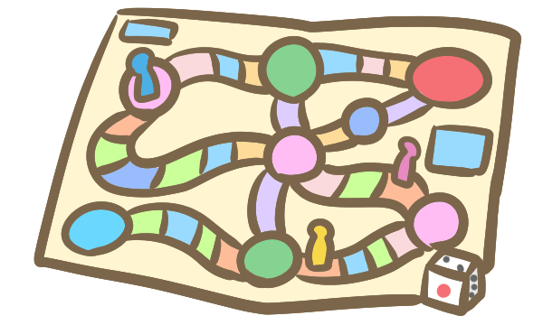

<!--
_class: lead
_header: ""
_paginate: false
-->

# 地元ですごろく！

---

# テーマ 『さぁ、架け橋を作ろう！』
人と人をつなぐ架け橋=コミュニケーション
　⇒初めましての人と話すネタになるもの
- 誰にでも関係がある
- 知らなくとも話すことができる
- 知っていたら更に盛り上がれる

　　　　　　　　　　　　　　　　……天気？

---
<!--
_class: lead
-->

# 地元
出身地・居住地・通学先・勤務先　など

---
# 地元ですごろく
誰かの生まれ育った町で　毎日通っている町で
夏休みに電車に乗って一人で行ったおじいちゃんの家があるあの町で

ストリートビューを見てあんなことやこんなことを思い出し喋りながら、すごろくをしませんか？

---
<!--
_class: lead
-->

# 実物を動かしてみよう！

---
# 今後の展望
- マスに